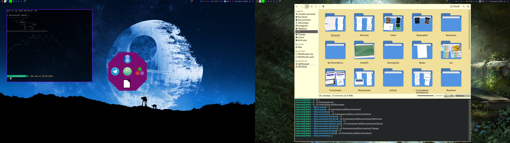

# dotfiles

Here you can find my dotfiles for

* neofetch
* vim
* awesome
* compton
* alacritty
* fish
* htop
* zathura
* ranger
* cli-vis
* bash
* redshift
* Dolphin

Most of the code you'll find here have been copied from several respositories, some of them are

* [AwesomeWM Widgets](https://pavelmakhov.com/awesome-wm-widgets/#tabMain)
* [Awesome copycats](https://github.com/lcpz/awesome-copycats)
* [Compton](https://github.com/chjj/compton)
* [Cli Visualizer](https://github.com/dpayne/cli-visualizer)

Also, I have used the [Awesome WM documentation](https://awesomewm.org/doc/api/index.html).

**Warning:** Probably most of the files you'll find here won't work on your machine. Please check the code before using them.

**Note:** The icons theme im using is [LyraY-Cursors](https://www.gnome-look.org/p/1543937).
